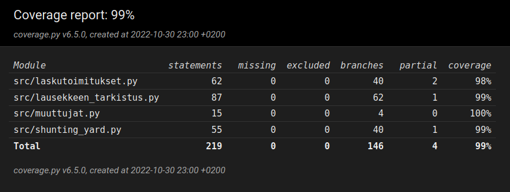

# Testausdokumentti

## Testien suorittaminen

Testien suorittaminen onnistuu komennolla `poetry run invoke test`.

Testikattavuusraportti generoidaan komennolla `poetry run invoke coverage-report`.

Testikattavuusraportti löytyy projektin hakemistosta tiedostosta *htmlcov/index.html*.

## Testikattavuusraportti

## Testaus

### Laskutoimitukset

*TestiLaskutoimitukset*-luokka testaa *Laskutoimitukset*-luokan *laske*-metodin toimintaa siten, että syötteenä annetaan postfix-muodossa oleva lauseke listana, josta *laske*-metodi laskee laskutoimituksen tuloksen. Peruslaskutoimituksia kahdella luvulla, funktioita, laskutoimituksia muuttujilla sekä pidemmän lausekkeen laskemista testataan erikseen.

### Lausekkeen tarkistus

*TestLausekkeenTarkistus*-luokka testaa *LausekkeenTarkistus*-luokan *tarkista*-metodin toimintaa antamalla syötteenä sekä hyväksyttäviä, että hylättäviä lausekkeita ja vertaamalla palauttaako *tarkista*-metodi hyväksytyn vai hylätyn tuloksen.

### Muuttujat

*TestiMuuttujat*-luokka testaa *Muuttujat*-luokan *lisaa_muuttuja*, *onko_muuttuja_olemassa* ja *arvo* -metodien toimintaa.

### Shunting yard

*TestiShuntingYard*-luokka testaa *ShuntingYard*-luokan *muunna*-metodia antamalla syötteenä lausekkeita ja vertaamalla, muuntaako metodi ne postfix-muotoon oikein.

